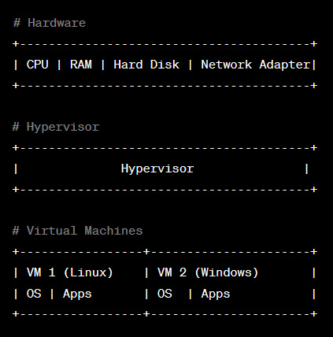
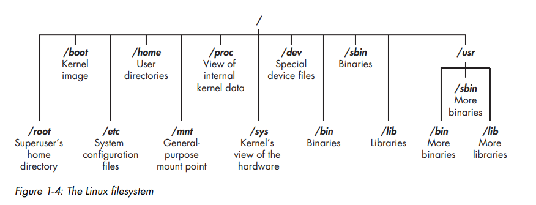
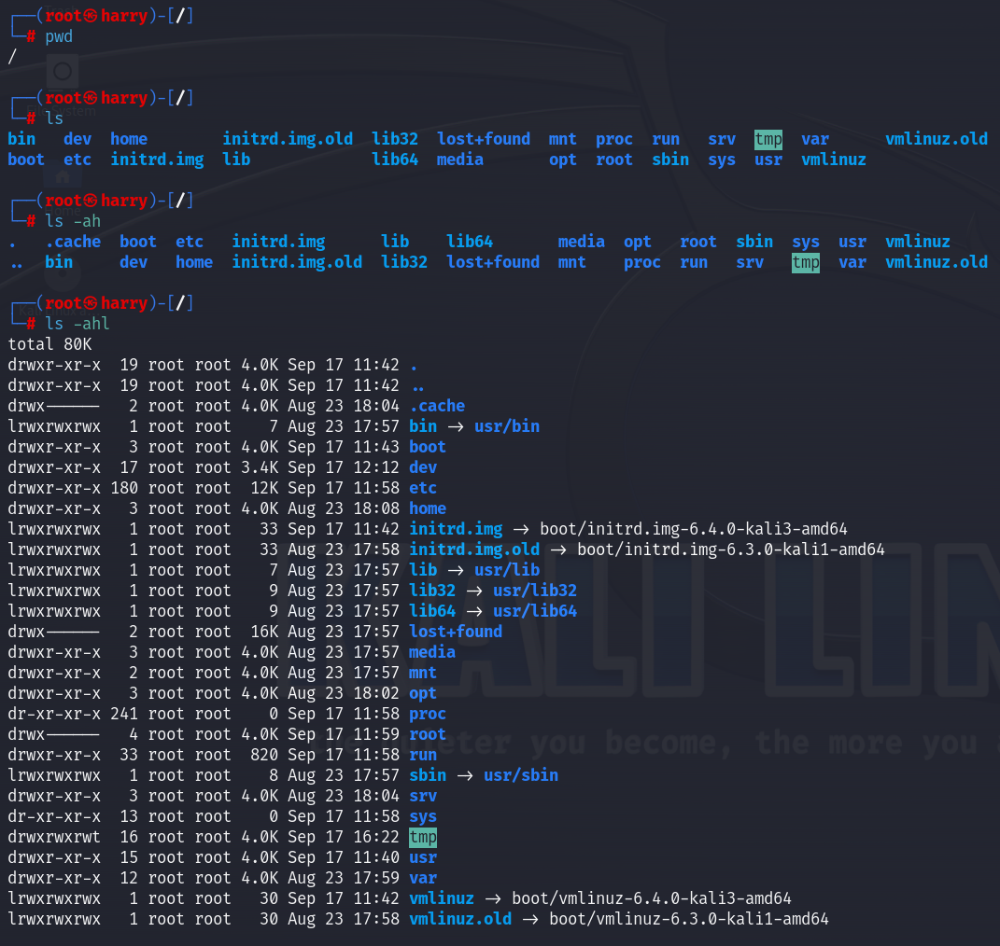
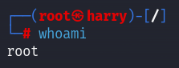
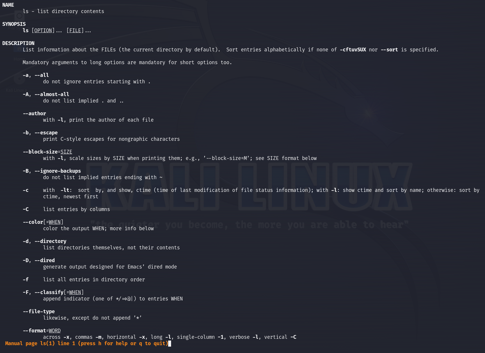
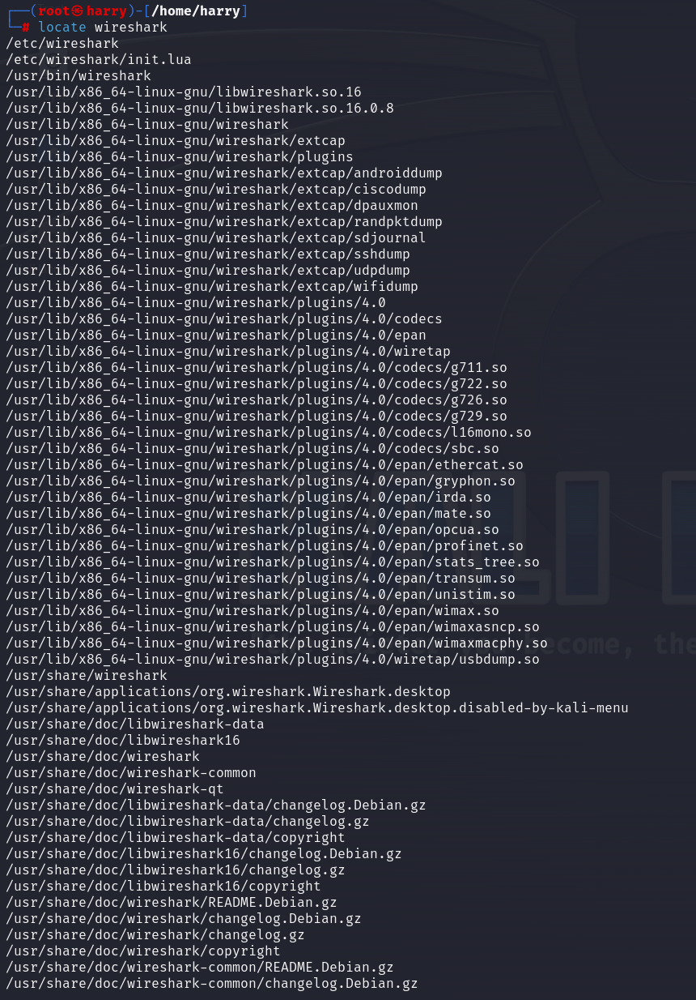
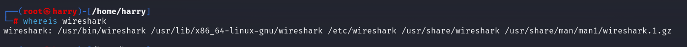

# **Kali Linux - a Memo**
<h3>
This repo is for educationnal purposes only, it's me 're'reading Linux Basics for Hackers from Occupytheweb and making some notes and/or adding details and explanations for me, my friends or anyone reading this.<br>It's a great book that I'd recommand for anyone wanting to learn the basics of Linux (or the hacking journey)<br>
If I had any screenshot from the book, I'll make sure to explicitly say what page it's from and credit the author
</h3>
<h2>Let's BEGIN!</h2>
<p>First and foremost, we need to set up a VM(virtual machine) and install kali Linux on it.<br>
The "how to set up a VM" is not the goal of this repo so i'll just link some good tutorial for it but "what is a VM" is kinda more interesting.<br>
Here is a really good and detailed tutorial from NetworkChuck:<br> https://youtu.be/wX75Z-4MEoM?si=HX4IPh_E2KB5JrAP&t=425</p>

<h2>So, what is a Virtual Machine ?</h2>
A Virtual Machine (VM) is a software-based emulation of a computer system that runs on a physical machine. It provides the functionality of a physical computer and allows you to run multiple operating systems on a single piece of hardware.<br>

- **Host Operating System**: The original OS installed on your machine.<br>
- **Guest Operating System**: The OS running within the VM.<br>
- **Hypervisor**: The software that creates, runs, and manages VMs. Examples include VMware, VirtualBox, and Hyper-V.<br>

<h2>How do Virtual Machines operate ?</h2>
<p>Virtual Machines operate by using a software layer called a "hypervisor" to emulate hardware resources. The hypervisor allocates these emulated hardware resources to each VM, making it possible to run multiple OS instances simultaneously.
</p>


<h2>Why are Virtual Machines useful?</h2>

- **Isolation**: VMs are isolated from each other, which enhances security.<br>
- **Resource Utilization**: Make effcient use of hardware by running multiple tasks on the same machine.<br>
- **Development**: Test and deplay code in various environments easily.<br>
- **Learning**: Experiment with different OS and software without affection your main system.<br>

<h2>Are Virtual Machines safe?</h2>
While VMs are generally considered safe due to isolation from the host and other VMs, they are not invulnerable. Risks include:

- **Misconfiguration**: Incorrect settings can compromise security.<br>
- **Vulnerabilities in the Hypervisor**: Security flaws can potentially be exploited.<br>
- **Ressource drain**: VMs require a share of the system's resources, affecting performance.<br>

<h2>Which VM software to choose?</h2>
There are a loot of VM softwares. It all depends on which one best suits your needs. Here is a small list:

- **VMware**: This is the one I personnaly use (the free version) on my desktop and VMware Fusion on my Mac.I find it to be more snappy than VirtualBox.<br>
- **VirtualBox**: One of the best, if not the best, open source VM software.<br>
- **Parallels**: The best VM software to run a Windows VM on MacOS.<br>
- **QEMU**: The best VM software for Linux users.It's open source and free of charge.<br>
- **ETC,ETC,...**: There are a lot more VM softwares on the market.Just google the one that suits you best.<br>

<h2>Linux commands</h2>
<h3>Linux fileSystem</h3>
Since Linux runs on Unix, it uses it's File System (documentation on this topic:https://www.geeksforgeeks.org/unix-file-system/)<br>
<br>
<h6>page 5 from Linux Basics for Hackers - Occupytheweb</h6>

Typing: <br>
```
cd /
```
Will cd (change directory) you to / which is the root of the filesystem <br>
<br>Typing
```
pwd
```
(print working directory) will write the full pathname of the current working directory to the standard output.Like this
<br>
In this screenshot you can see that pwd outputs /, that's because it's where we are after cd'ing to /<br>
As you can also see, we're logged in as root.<br>
That's because root is the superuser that has access to everything in the OS.<br>
If you type:
```
whoami
```
You'll see this:<br>
<br>
I'm going to explain how to log in as root after explaining the other commands shown of the previous screenshot.<br>
But for the note root is the gigachad of the linux system.<br>
<br>The:
```
ls
```
command stands for listing, adding -a will show you all the files/directories in your current directory, -h for human readable, -l for long or combine them like in the exemple.<br>
There are other options you can add to a command and the best way to find these option is the command:
```
man
```
For exemple, *man ls* will show you this:<br>
<br>

The:
```
locate
```
command is to locate things easily and fast.<br>
Here is what it looks like<br>
The problem of locate is that it gives us to much information so linux has another command in order to find exactly what we need.
<br>

And that command is:
The:
```
whereis
```
that is used to locate the binary executable files of a program. Additionally, it can also locate the source code and manual page files for the program if they are present.<br>
Example:<br>
<br>
