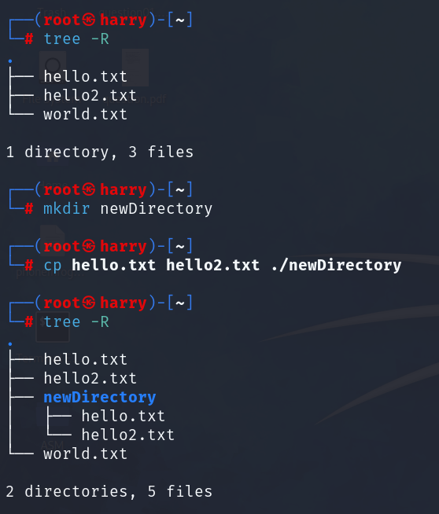

# **Kali Linux - a Memo**
<h3>
This repo is for educationnal purposes only, it's me 're'reading Linux Basics for Hackers from Occupytheweb and making some notes and/or adding details and explanations for me, my friends or anyone reading this.<br>It's a great book that I'd recommand for anyone wanting to learn the basics of Linux (or the hacking journey)<br>
If I had any screenshot from the book, I'll make sure to explicitly say what page it's from and credit the author
</h3>
<h2>Let's BEGIN!</h2>
<p>First and foremost, we need to set up a VM(virtual machine) and install kali Linux on it.<br>
The "how to set up a VM" is not the goal of this repo so i'll just link some good tutorial for it but "what is a VM" is kinda more interesting.<br>
Here is a really good and detailed tutorial from NetworkChuck:<br> https://youtu.be/wX75Z-4MEoM?si=HX4IPh_E2KB5JrAP&t=425</p>

<h2>So, what is a Virtual Machine ?</h2>
A Virtual Machine (VM) is a software-based emulation of a computer system that runs on a physical machine. It provides the functionality of a physical computer and allows you to run multiple operating systems on a single piece of hardware.<br>

- **Host Operating System**: The original OS installed on your machine.<br>
- **Guest Operating System**: The OS running within the VM.<br>
- **Hypervisor**: The software that creates, runs, and manages VMs. Examples include VMware, VirtualBox, and Hyper-V.<br>

<h2>How do Virtual Machines operate ?</h2>
<p>Virtual Machines operate by using a software layer called a "hypervisor" to emulate hardware resources. The hypervisor allocates these emulated hardware resources to each VM, making it possible to run multiple OS instances simultaneously.
</p>


<h2>Why are Virtual Machines useful?</h2>

- **Isolation**: VMs are isolated from each other, which enhances security.<br>
- **Resource Utilization**: Make effcient use of hardware by running multiple tasks on the same machine.<br>
- **Development**: Test and deplay code in various environments easily.<br>
- **Learning**: Experiment with different OS and software without affection your main system.<br>

<h2>Are Virtual Machines safe?</h2>
While VMs are generally considered safe due to isolation from the host and other VMs, they are not invulnerable. Risks include:

- **Misconfiguration**: Incorrect settings can compromise security.<br>
- **Vulnerabilities in the Hypervisor**: Security flaws can potentially be exploited.<br>
- **Ressource drain**: VMs require a share of the system's resources, affecting performance.<br>

<h2>Which VM software to choose?</h2>
There are a loot of VM softwares. It all depends on which one best suits your needs. Here is a small list:

- **VMware**: This is the one I personnaly use (the free version) on my desktop and VMware Fusion on my Mac.I find it to be more snappy than VirtualBox.<br>
- **VirtualBox**: One of the best, if not the best, open source VM software.<br>
- **Parallels**: The best VM software to run a Windows VM on MacOS.<br>
- **QEMU**: The best VM software for Linux users.It's open source and free of charge.<br>
- **ETC,ETC,...**: There are a lot more VM softwares on the market.Just google the one that suits you best.<br>

<h2>Linux commands</h2>
<h3>Linux fileSystem</h3>
Since Linux runs on Unix, it uses it's File System (documentation on this topic:https://www.geeksforgeeks.org/unix-file-system/)<br>
<br>
<h6>page 5 from Linux Basics for Hackers - Occupytheweb</h6>

Typing: <br>
```
cd /
```
Will cd (change directory) you to / which is the root of the filesystem <br>
<br>Typing
```
pwd
```
(print working directory) will write the full pathname of the current working directory to the standard output.Like this <br>
<br>
In this screenshot you can see that pwd outputs /, that's because it's where we are after cd'ing to /<br>
As you can also see, we're logged in as root.<br>
That's because root is the superuser that has access to everything in the OS.<br>
If you type:
```
whoami
```
You'll see this:<br>
<br>
I'm going to explain how to log in as root after explaining the other commands shown of the previous screenshot.<br>
But for the note root is the gigachad of the linux system.<br>
<br>The:
```
ls
```
command stands for listing, adding -a will show you all the files/directories in your current directory, -h for human readable, -l for long or combine them like in the exemple.<br>
There are other options you can add to a command and the best way to find these option is the command:
```
man
```
For exemple, *man ls* will show you this:<br>
<br>

<br>The:
```
locate
```
command is to locate things easily and fast.<br>
Here is what it looks like<br>
The problem of locate is that it gives us to much information so linux has another command in order to find exactly what we need.<br>
<br>

<br>And that command is:
The:
```
whereis
```
that is used to locate the binary executable files of a program. Additionally, it can also locate the source code and manual page files for the program if they are present.<br>
Example:<br>
<br>

<br>There is also another command used to locate a specific file associated with an executable command. It's the command:
```
which
```
<br>

whereis and which both locate command related files. But which is more focused on finding the executable in the PATH, whereas whereis provides a comprehensive search, locating binaries, source files, and man pages.

<br>
<h3>the command "find", a powerful command</h3>
The find command in UNIX and Linux is a powerful utility for searching and locating files and directories 
within the filesystem based on various criteria such as names, sizes, types,<b> permissions </b>, modification dates
 and more. Its versatility and ability to execute commands on the files it finds make it an indispensable tool for
 system administration, scription, and daily file management tasks.
 <br>

```
find [path...] [options...] [expression]
```
<h4>Criteria:</h4> <br>

- **By Name :**  `-name 'filename'` searches for files taht match the given filename. User wildcards ('*', '?') for patterns.
- **By Type :** `-type f` for files, `-type d` for directories, etc.
- **By Modification Time :** `-mtime +n` for files modified more than n days ago, `-mtime -n` for files modified less than n days ago.
- **By Size :** `-size +nM` for files largen than n Megabytes, `-size -nM` for smaller.
- **By Permissions :** `-perm 644` for files with a specific permissions.
- **By Owner :** `-user username` for files owned by a specific user.
- **By Group :** `-group groupname` for files belonging gt oa specific group.

Find can also perform action on located files:

- **`-print`** : Displays the path of the found items(default action).
- **`-exec`** : Execute a command on each found item.
- **`-delete`** : Delete the found items.
- **`-ls`** : Lists the found items in "ls -l" format.

<h4>Power and Flexibility:</h4> <br>

- **Pipelines and redirection :** `find` can be combined with other commands using pipes (' | ') and 
redirection (' > ', '>>') for complex workflows.
- **Custom scripts :** Use `-exec` to run custom scripts on each found item for bespoke processing tasks.
- **Complex expressions :** Combine criteria with logical operators (' -and ', ' -or ', ' -not ') for precised searches.

<h4>Caution:</h4> <br>

- **Performance :** Searches starting from root('/') or other large directories can be time-consuming.
- **Deletion :** the `-delete` action is irreversible. Use it with caution, preferable with `-print` first to see what would be deleted.

<br>
<h3>Piping and grep</h3>

Piping and `grep` command are fundamental concepts in Linux and Unix-like operating systems, allowing for powerful
command-line data processing and manipulation. Piping, denoted by the pipe character `|`, is a mechanism to pass the output
of one command as the input to another command. This allows you to chain together a sequence of commands, creating a 
pipeline that can perform complex data processing tasks. Piping is a cornerstone of Unix and Linux philosophy, which 
emphasizes small, modular utilities that do one thing well and can be combined in warious ways.
<br>

`grep` is a command-line utility for searching plain-text data sets for lines that match a regular expression.
Its name comes from the `ed` command `g/re/p`(globaly search a regular expression and print)
<h4>Basic usage of grep:</h4>

- **Search for a specific string in a file:** `grep "search_string" filename`
- **Search for a pattern in multiplefiles:** `grep "patern" file1 file2 file3`
- **Example:** You want to find rockyou.txt and check if somepassword of yours is in there <br>

<br>
<br>

<h3>Creating files</h3>

`touch` creates empty files. It can also update the access and modification times of a file, but if the file
doesn't exist, `touch` creates a new empty file.
```
touch filename
```

<br>

`echo` is primarily used to display a line of text, but when combined with redirection operators, it can also create a 
file and write content on it.
```
echo "some content" > filename
```
'>' writes the output of `echo` to `filename` creating the file if it doesn't exist. If it exists, this overwrites its content.
">>' appends the output to the file instead of overwriting it. <br>

<br>

<br>

`printf` is similar to echo but offers more control over the output format, making it usefull for scripting.

```
printf "some content\n" > filename
``` 

<br>

`cat` concatenates and displays file content(as seen above), but with redirection, it can create files and append content.<br>

`cat > filename` will make you type content into the terminal. It will override existing data. Press CTRL+D to end
the input and create/update the file.
`cat >> filename` will do append your input to the file.<br>


<br>

<br>

`tee` command reads from standart input and writes to standard output and files. When used with `echo` or on its own
pipeline, it can create files. `-a` appends content to existing files without overwriting.

```
echo "content" | tee filename
```
 <br>

`cp` creates a new file as a copy of an existing file

```
cp existingfile newfile
```


<br>
<br>

`dd` is a low-level utility for converting and copying files. It can create files by copying data frmo a source to 
a destination. Exemple copy one of the hello file to a new one:
```
dd if=hello.txt of=world.txt
```


<br>

<br>

Opening a non-existent file with a text editor and saving it creates the file with `vim`, `nano`, `emacs`, `nvim`, etc..

<br>

<br>

`mktemp` can create a temporary file or directory. Useful in scripts for creating temporary files securely.

<br>

<br>

`mkdir` can create directories.
```
mkdir newDirectory
```
you can for exemple create a new directory and copy the files you have unto that new directory like this:

<br>
tree will list the contents of directories in a tree-like format. Then you can create the new directory and use
cp to copy whatever you want.

<br>

<br>

`mv` command can be used to move a file or directory to a new location of simply give an existing file a new name. Example:<br>


<br>

<br>

`rmdir` will remove 'empty' directories. If the directory is not empty, you'll have a warning message that the directory
is not empty. In order to remove a non empty directory, you'll need to remove a dir and its content recursevly with
`rm -r` like this: <br>

